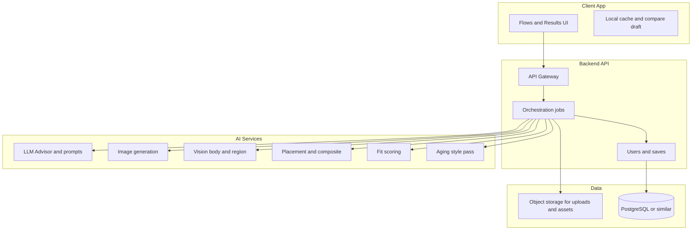

# AI Tattoo Advisor — End-to-End Implementation Plan

**Audience:** Product management, engineering lead, and implementation agents.  
**Companion docs:** [PRODUCT_SPEC.md](PRODUCT_SPEC.md) (what we build), [MEHNDI_ARCHITECTURE.md](MEHNDI_ARCHITECTURE.md) (Mehndi reference + **image-edit model decision**). This file describes **how** we build it.

**Last updated:** March 29, 2026

---

## 1. North star (locked)

Ship a **tattoo decision platform**: guided flows → **shared result screen** with body preview, **explained** fit, optional aging, save/compare—not a bare image generator.

**Non-negotiables from spec:**

- Body-first and meaning-first UX.
- ~5 questions per flow, then AI inference.
- Aging = **visual simulation** only (copy and UX must never imply medical claims).

---

## 2. Phased delivery (product)

### Phase 0 — Foundations (week 1–2)

- Repo, CI, environments (dev/staging/prod).
- Auth (anonymous + optional account for cross-device saves).
- **Telemetry** baseline (events in §7) so you measure from day one.
- Design system shell: home hero, six entry cards, navigation to flow shells.

### Phase 1 — Lighter fallback MVP (ship first)

Aligned with [PRODUCT_SPEC.md — Lighter fallback MVP](PRODUCT_SPEC.md#mvp-scope):

| # | Deliverable |
|---|----------------|
| 1 | Home with six options (stub or “coming soon” only if you must ship UI first—prefer real routes). |
| 2 | Flows: **New to Tattoos**, **Generate from My Idea**, **Convert Photo**, **Deep Meaning** (wizard + API contracts). |
| 3 | **Virtual body preview** (minimum viable: one placement path that works reliably). |
| 4 | **Fit score** + short explanation (rule-based v1 is acceptable). |
| 5 | **Save + compare** (local + server if user is signed in). |

**Exit criteria:** User can complete any of the four flows, see 2–3 concepts, preview on body, read fit score, save and compare.

### Phase 2 — Full MVP extensions

| # | Deliverable |
|---|----------------|
| 1 | **Cover Up / Scar Redesign** flow + generation path tuned for that use case. |
| 2 | **Couple Tattoo** flow + paired outputs + optional dual preview. |
| 3 | **Aging simulation** (three views: fresh / healed / longer-term stylized). |
| 4 | Hardening: performance, error states, rate limits, abuse controls on uploads. |

### Phase 3 — Polish and growth

- Refinement actions on result screen (bolder, subtler, move placement, etc.) as **real** or **queued** jobs (see §5).
- Share flows, exports (later: artist-ready sheets per monetization).
- Monetization hooks only after retention metrics justify them.

---

## 3. System architecture (technical)

### 3.1 High-level

### 3.2 Client

**Recommendation:** **Web-first** (React/Next.js or similar) for fastest iteration and easy sharing; add **PWA** for installability. If you already know **mobile** from Mehndi, you can mirror patterns (React Native + shared API)—same backend.

**Client responsibilities:**

- Wizard state per flow (5-step cap + derived fields).
- Photo capture/upload with **client-side resize** and format checks.
- Result screen: concept carousel, body preview viewer, fit panel, actions.
- **Compare** grid from saved items (IDs or local snapshots).
- Optional: WebGL/canvas for **manual** placement adjust (Phase 2+).

### 3.3 Backend

**Core services:**

- **Orchestration:** One “session” or “generation job” per flow completion; steps may be async (queue).
- **User/saves:** Persisted concepts (image URLs, metadata: style, coverage, flow type, fit snapshot).
- **Media:** Virus scan + size limits; signed URLs; retention policy (e.g. delete raw body photos after N days if privacy-first).

**API shape (conceptual):**

- `POST /flows/{flowId}/sessions` — start; collect answers.
- `POST /sessions/{id}/generate` — run pipeline; returns job id.
- `GET /jobs/{id}` — poll for concepts + preview + fit.
- `POST /sessions/{id}/refine` — refinement actions (map to new prompt or edit job).
- `GET/POST /saves` — save/compare.

---

## 4. AI and computer vision pipeline

This is where “tattoo generator” apps differ from your **advisor** positioning.

### 4.1 Concept generation and on-body preview (primary path — same class as Mehndi)

**Decision (see [MEHNDI_ARCHITECTURE.md](MEHNDI_ARCHITECTURE.md)):** Use the **same strategy as MehndiAI**: an **image-edit** model (e.g. `prunaai/p-image-edit` on Replicate or equivalent) takes the user’s **body photo** + a **tattoo prompt** and returns a **single image** with the tattoo **applied on skin** in one pass. **Body placement** and **composition** are driven by **prompt engineering** (body region, orientation, coverage), analogous to Mehndi’s hand-side and layout blocks.

- **2–3 concepts:** Run **2–3 edit jobs** with different **seeds** and/or **randomized sub-prompts** (same pattern as Mehndi’s `generate_*_variations` functions).
- **Inputs:** Flow answers + **body region** + optional **reference image** for photo-to-tattoo or cover-up (constraints in prompt).
- **LLM role:** Turn flow answers into the **structured edit prompt** and **card explanations** + fit narrative; optional second pass for negative phrasing.
- **Provider:** Start with **one** image-edit API behind an interface (reuse Mehndi’s HTTP + polling pattern where useful).

**Tattoo-specific prompting:** Black/grey ink, line weight, style presets from the spec; **preserve skin texture, lighting, background**; no jewelry unless user asked; **no henna-style** language unless testing alternate looks.

### 4.2 Alternative and additive paths (optional)

| Stage | Approach | Notes |
|-------|-----------|--------|
| **Alt** | **Txt2img** flash + **alpha compositing** + user drag/scale | Fallback if edit model struggles on some body parts; useful for **stencil export** |
| **v1 add-on** | **Segmentation** or **pose** to suggest default crop / prompt hints | Improves placement before edit |
| **v2** | Stronger warp / inpaint tooling | Only if product needs pixel-perfect artist workflows |

**Default MVP:** **Image-edit on body photo** (aligned with Mehndi), not overlay-first.

### 4.3 Fit score (v1 = rules; v2 = ML)

**v1 (ship fast):** Deterministic score from:

- Declared body region + design **coverage** (S/M/L) + **style** (fine line vs heavy blackwork).
- Heuristics: e.g. fine-line + small area → flag “detail may blur”; large area + high density → “busy” warning.

**LLM or small model:** Produce **4–6 bullet explanations** matching the spec’s dimensions (readability, curvature, etc.) **consistent** with the numeric score.

**v2:** Train or calibrate on pairwise preferences or artist labels; keep UI contract stable.

### 4.4 Aging simulation

- **Not** a medical model. **Three visual styles:** fresh (high contrast), healed (slightly muted), long-term (simplified edges / softer blacks).
- Implementation options: **image-to-image** pass with fixed prompts, **CSS/filter** prototype (weak), or **second gen** with “faded tattoo” prompt. Prefer **one** cheap, consistent pipeline.

### 4.5 Cover-up and couple flows

- **Cover-up:** Extra vision pass: describe **existing ink/scar** from photo + constraints (“must cover X”); generation with **strong** structural prompts; **realism note** in UI (honest limits).
- **Couple:** Single **paired brief** with two outputs; optional **two preview** uploads if you support dual body preview in Phase 2.

---

## 5. Mapping flows to engineering work

| Flow | Key backend work | Key AI work |
|------|------------------|-------------|
| New to Tattoos | Meaning chips → brief | Multi-concept gen + diversity |
| Generate from My Idea | Style enum → prompt | Same |
| Photo → Tattoo | Upload handling; **ref** image | img2img or vision-describe-then-txt2img |
| Cover-up | Same + stronger constraints | Mask-aware or region-focused prompts |
| Deep Meaning | Theme + symbolism | Narrative + symbolic imagery |
| Couple | Paired session | Paired generation + shared meaning text |

All converge on **shared result** schema: `concepts[]`, `previewUrl`, `fit`, `explanations`, `refineActions`.

---

## 6. Team roles (can be one person wearing many hats)

| Role | Responsibility |
|------|----------------|
| **PM** | Phases, scope cuts, copy for disclaimers, success metrics |
| **Tech lead** | Architecture, API contracts, provider choices, security |
| **Frontend** | Flows, result screen, compare, uploads |
| **Backend** | Jobs, storage, auth, saves |
| **ML/AI** | Prompts, placement v2, fit v2 (as needed) |
| **Design** | Home, flow density, result legibility |

---

## 7. Instrumentation (from spec)

Minimum events: `home_view`, `flow_start`, `flow_complete`, `generate_success`, `body_preview_used`, `fit_expanded`, `save_concept`, `compare_open`, `aging_run`, `session_return`.

---

## 8. Risks and mitigations

| Risk | Mitigation |
|------|------------|
| **NSFW / harmful content** | Upload moderation, prompt policies, blocklist, report flow |
| **Privacy (body photos)** | Clear policies, encryption at rest, optional auto-delete |
| **Cost spikes at launch** | Job queue, caps per user, caching of style presets |
| **“Fake” fit score** | Honest copy; v1 as “advisory”; avoid over-precision |
| **Placement looks wrong** | Start with user-adjustable overlay; iterate vision |

---

## 9. Reuse from your Mehndi project

Canonical reference: **[MEHNDI_ARCHITECTURE.md](MEHNDI_ARCHITECTURE.md)** (paths under `Desktop\m\`).

**Reuse directly:**

- **Image-edit pipeline:** Same model **family** and **Replicate call pattern** (`replicate_api.py`: base64 input, prompt templates, seed, variation blocks, polling).
- **API shape:** Multipart upload, preprocessing (resize, EXIF), response as **image bytes** + metadata headers.
- **Frontend:** Client resize, `FormData`, long timeout, optional device id / credits.

**Extend for Tattoo-Ai:**

- **Body region** enums and prompts (not only hand front/back).
- **Multiple jobs** per result (2–3 concepts) + merge into shared result screen.
- **Fit score** + aging (post-pass or separate lightweight calls).
- Flows: meaning, cover-up, couple (prompt templates per flow).

Overlay-only compositing remains an **optional** fallback, not the primary design.

---

## 10. Suggested build order (first four sprints)

1. **Sprint A:** Monorepo, auth stub, home UI, one flow end-to-end (**Generate from My Idea**) → mock AI → **real** AI → result screen.
2. **Sprint B:** Remaining Phase 1 flows (wizard + same result contract); **save/compare**; **fit score v1**.
3. **Sprint C:** **Body preview** MVP (upload + overlay + adjust); telemetry.
4. **Sprint D:** Cover-up + couple + aging (Phase 2) or split into D/E by capacity.

---

## 11. Decision checklist (before coding)

- [ ] **Primary client:** Web vs mobile (or both).
- [ ] **Image provider:** Which API first (cost/latency/quality tradeoff).
- [ ] **Data residency:** Where users are; GDPR/CCPA if applicable.
- [ ] **Anonymous vs account-first** for saves.

Record decisions in an ADR or short `DECISIONS.md` as you go.

---

## 12. References

- Product requirements: [PRODUCT_SPEC.md](PRODUCT_SPEC.md)  
- This plan should be updated when stack choices or phase boundaries change.
