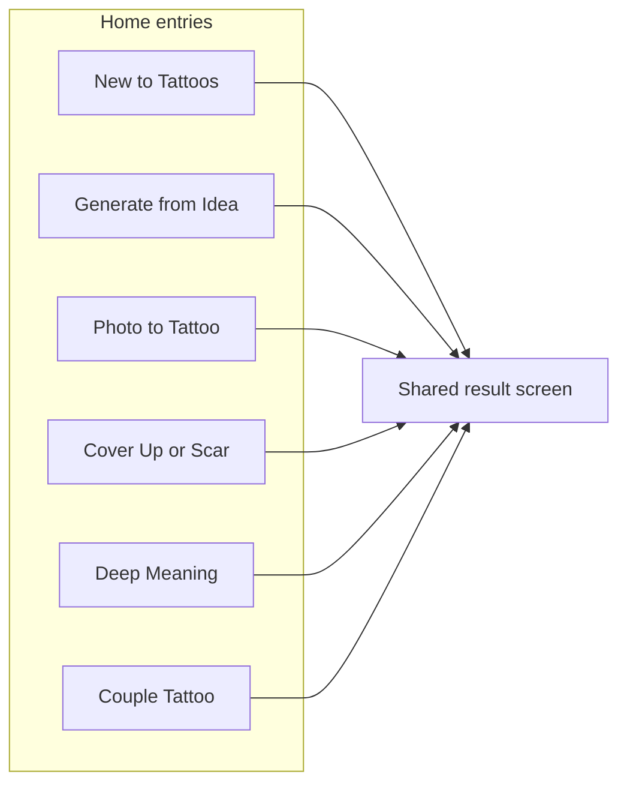

# AI Tattoo Advisor and Virtual Tattoo Preview — Product Specification

**One-line positioning:** An AI tattoo advisor that helps users discover, preview, compare, and refine tattoos on their own body before committing.

**Last updated:** March 29, 2026

---

## Table of contents

- [How to use this document](#how-to-use-this-document)
- [Executive summary](#executive-summary)
- [Market gap](#market-gap)
- [Differentiation](#differentiation)
- [Target users](#target-users)
- [Product goals](#product-goals)
- [Product principles](#product-principles)
- [Core features (inventory)](#core-features-inventory)
- [Home screen structure](#home-screen-structure)
- [Main product flows](#main-product-flows)
  - [Flow 1: New to Tattoos](#flow-1-new-to-tattoos)
  - [Flow 2: Generate from My Idea](#flow-2-generate-from-my-idea)
  - [Flow 3: Convert Photo into Tattoo](#flow-3-convert-photo-into-tattoo)
  - [Flow 4: Cover Up or Scar Redesign](#flow-4-cover-up-or-scar-redesign)
  - [Flow 5: Deep Meaning Tattoo](#flow-5-deep-meaning-tattoo)
  - [Flow 6: Couple Tattoo](#flow-6-couple-tattoo)
- [Shared result screen](#shared-result-screen)
- [Fit score system](#fit-score-system)
- [Aging simulation](#aging-simulation)
- [Save and compare](#save-and-compare)
- [User experience strategy](#user-experience-strategy)
- [MVP scope](#mvp-scope)
- [Monetization (later)](#monetization-later)
- [Long-term expansion ideas](#long-term-expansion-ideas)
- [Success metrics](#success-metrics)
- [Appendix: positioning copy](#appendix-positioning-copy)

---

## How to use this document

- This file is the **product north star** for the AI Tattoo Advisor: a tattoo **decision platform**, not a generic image app.
- Implement and prioritize work against **[MVP scope](#mvp-scope)**; defer monetization and long-term items unless explicitly pulled in.
- Every major flow should converge on the **[Shared result screen](#shared-result-screen)** (preview, concepts, fit score, actions).
- **Body-first** and **meaning-first** differentiate this from shallow generators: preserve placement, fit evaluation, and guided discovery in feature design.
- **Aging simulation** is always framed as **visual simulation**, not medical or clinical advice.

---

## Executive summary

### Vision

Build an AI-powered tattoo product that helps people make better tattoo decisions **before** they commit. The app is not only a tattoo generator. It is a **tattoo advisor**, **tattoo planner**, and **virtual tattoo preview** system.

**Core value:** Help users discover the right tattoo, place it on their body virtually, evaluate how well it fits, and refine it before getting it done in real life.

This product sits **between inspiration and decision making**.

### Problem

Getting a tattoo is a high-trust, high-emotion decision. Most people struggle with one or more of:

- Not knowing what tattoo **style** fits them
- Not knowing what **body placement** works best
- A vague idea that they cannot turn into a strong concept
- Wanting something **meaningful** but not knowing how to represent it visually
- Wanting to see how the tattoo would look on **their own body**
- **Regret** anxiety and desire to **compare options** before committing
- **Old tattoos or scars** and need for redesign or cover-up help
- Basing a tattoo on a **memory, person, pet, or photo**
- **Couples** wanting connected ideas without spending excessive time at the idea stage with artists

**Current apps** often solve only one slice: **generate images**. That is not enough.

### Expanded positioning

This app uses AI to:

- Recommend tattoos based on **meaning**, **body placement**, and **visual taste**
- Generate tattoo concepts from **text**, **photos**, and **themes**
- Place tattoos virtually on the user’s body
- Evaluate fit using **body-aware scoring**
- Simulate how tattoos may look **over time**
- Suggest **cover-up**, **scar redesign**, and **couple tattoo** concepts

---

## Market gap

Existing products include AI tattoo generators and virtual try-on tools, but many remain shallow. They often emphasize:

- Text-to-image tattoo generation
- Simple style presets
- Virtual placement
- Subscriptions and paywalls

They often do **not** deeply address:

- Tattoo **fit** for body shape and surface area
- **Meaning-first** tattoo discovery
- **Personalized recommendation** logic
- **Cover-up** and **scar redesign** planning
- **Long-term visual aging** simulation
- **Paired couple** concept generation in a **guided** way
- **Decision confidence**

**Opportunity:** A product that feels more like an **intelligent tattoo advisor** than an image generator.

---

## Differentiation

This product combines multiple layers in one experience:

| Layer | Role |
| --- | --- |
| Tattoo generation | Concepts from prompts, themes, photos |
| Body-aware preview | Placement on the user’s photo |
| Guided recommendation | Short flows, smart inference |
| Fit evaluation | Scoring and explanation |
| Emotional meaning | Discovery from values, memory, symbolism |
| Photo conversion | Pets, people, objects, sketches → tattoo-ready concepts |
| Cover-up / scar | Concealment, blending, redesign directions |
| Couple mode | Matching or complementary ideas |
| Aging simulation | Fresh vs healed vs longer-term **visual** views |

Most competitors stop at generation and preview. This app goes further into **personalization** and **decision support**.

---

## Target users

| Segment | Description |
| --- | --- |
| **New tattoo users** | Little knowledge of styles, placements, or coverage |
| **Decisive users** | Rough idea known; want fast generation and preview |
| **Meaning-driven users** | Start from feeling, value, event, belief, or theme |
| **Photo-driven users** | Turn image, memory, person, pet, object, or sketch into a tattoo |
| **Cover-up users** | Hide, blend, redesign around old ink or scars |
| **Couples** | Matching or complementary tattoos |

---

## Product goals

### Primary

- Help users find tattoo ideas they feel **confident** about
- Show tattoos on the user’s body **virtually**
- Reduce uncertainty and tattoo **regret**
- Make planning **personalized**
- Create a memorable experience **more useful** than generic generators

### Secondary

- Increase **save** and **compare** behavior
- Create **sharing** moments
- **Repeat usage** through refinement and exploration
- Enable future **monetization** pathways

---

## Product principles

1. **Body first** — The app should not only generate images. It should understand **placement** and how the design **fits** the chosen area.
2. **Meaning matters** — Users can start from emotion, philosophy, memory, or symbolism, not only a text prompt.
3. **Visual confidence** — Users must preview tattoos on their body before deciding.
4. **Guidance over complexity** — Few questions; short flows with smart inference.
5. **Evaluation matters** — Results are not only shown; they are **explained**.

---

## Core features (inventory)

Use this as a build checklist against MVP.

- [ ] **Virtual body preview** — Upload a body photo; see concepts placed on the body
- [ ] **AI tattoo generation** — From prompts, guided choices, meaning themes, photos
- [ ] **Tattoo fit score** — Score designs for body suitability and design fit
- [ ] **Aging simulation** — Fresh, healed, longer-term **visual** appearance (non-medical)
- [ ] **Photo to tattoo** — Uploaded images → tattoo-ready concepts
- [ ] **Cover-up and scar redesign** — Concealment, blending, redesign suggestions
- [ ] **Couple tattoo generation** — Matching or complementary concepts for two people
- [ ] **Save and compare** — Multiple concepts side by side

---

## Home screen structure

The app opens with a clear promise and **six main entry points**.

### Hero

- **Heading:** See your tattoo on your body before you commit
- **Subtext:** AI tattoo ideas customized for you, with virtual body preview, photo to tattoo conversion, cover up concepts, couple tattoos, and aging simulation

### CTAs

- **Primary:** Start Designing
- **Secondary:** Try on My Body

### Main options (six)

1. New to Tattoos  
2. Generate from My Idea  
3. Convert Photo into Tattoo  
4. Cover Up or Scar Redesign  
5. Deep Meaning Tattoo  
6. Couple Tattoo  

### Feature strip

- Virtual Body Preview  
- AI Customized Tattoo Suggestions  
- Fit Score  
- Aging Simulation  
- Save and Compare  

---

## Main product flows

Ask **at most ~5 questions** per flow, then let AI infer the rest. Each flow should support **body preview** where possible.

### Flow 1: New to Tattoos

**Purpose:** Guide users who are unsure what tattoo they want.

**Questions**

- What kind of tattoo are you looking for: **Meaningful** | **Aesthetic** | **Bold statement** | **Not sure**
- Where do you want it: **I know the body part** | **Help me choose** | **Upload a body photo**
- What look do you prefer: **Subtle** | **Balanced** | **Bold**
- How much coverage: **Small** | **Medium** | **Large** | **Not sure**
- What matters more: **Meaning** | **Visual style** | **Both**

If **meaning** or **both**: show chips such as: Strength, Faith, Patience, Rebirth, Healing, Love, Family, Discipline, Freedom, Hope, Peace, Loss.

**Output**

- 3 tattoo directions  
- Body preview  
- Fit score  
- Explanation  
- Refine options  
- Aging simulation  
- Save and compare  

---

### Flow 2: Generate from My Idea

**Purpose:** Direct concept generation from text.

**Questions**

- What is your idea?
- Where do you want it?
- Which style do you want?
- How strong should it look?
- How much coverage do you want?

**Style options**

- Auto choose for me  
- Minimalist  
- Fine Line  
- Blackwork  
- Traditional  
- Script  
- Geometric  
- Ornamental  
- Japanese  
- Realism  

**Output**

- 2 or 3 tattoo concepts  
- Body preview  
- Fit score  
- Explanation  
- Refine options  
- Aging simulation  
- Save and compare  

---

### Flow 3: Convert Photo into Tattoo

**Purpose:** Turn a photo, sketch, pet, person, object, or symbol into a tattoo concept.

**Questions**

- Upload photo
- How should we turn it into a tattoo?
- Where do you want it?
- How strong should it look?
- How much coverage do you want?

**Conversion style options**

- Fine Line  
- Blackwork  
- Minimal  
- Stencil style  
- Realistic  
- Geometric interpretation  
- Ornamental interpretation  

**Output**

- Original photo  
- Tattoo interpretations  
- Body preview  
- Fit score  
- Explanation  
- Aging simulation  
- Save and compare  

---

### Flow 4: Cover Up or Scar Redesign

**Purpose:** Cover, blend, redesign, or work visually with scars or old tattoos.

**Questions**

- Upload your tattoo or scar photo
- What do you want to do?
- What kind of result do you want?
- How visible should the final tattoo be?
- How much area can the new tattoo cover?

**Mode options**

- Cover an old tattoo  
- Blend with an old tattoo  
- Redesign an old tattoo  
- Hide a scar with tattoo art  

**Desired result options**

- Natural blending  
- Strong cover up  
- Artistic redesign  
- Not sure  

**Coverage options**

- Same size  
- Slightly larger  
- Much larger  
- Not sure  

**Output**

- 2 or 3 redesign directions  
- Body preview  
- Realism note  
- Fit score  
- Explanation  
- Aging simulation  
- Save and compare  

---

### Flow 5: Deep Meaning Tattoo

**Purpose:** Generate tattoos from personal values, life themes, emotions, spirituality, or philosophy.

**Questions**

- What kind of meaning are you looking for?
- What kind of expression do you want?
- Where do you want it?
- How visible should it feel?
- What form do you prefer?

**Meaning options**

Strength, Faith, Patience, Love, Family, Loss, Healing, Rebirth, Discipline, Freedom, Hope, Philosophy, Custom topic

**Expression options**

- Deep and symbolic  
- Elegant and subtle  
- Bold and powerful  
- Poetic  
- Spiritual  

**Form options**

- Symbol  
- Script or quote  
- Symbol plus script  
- Abstract  
- Let AI decide  

**Output**

- 3 symbolic directions  
- Body preview  
- Meaning explanation  
- Fit score  
- Aging simulation  
- Save and compare  

---

### Flow 6: Couple Tattoo

**Purpose:** Matching or complementary tattoo ideas for two people.

**Questions**

- How would you like to start?
- What kind of couple tattoo do you want?
- What should it feel like?
- Where should these tattoos go?
- How visible should they be?

**Start options**

- Use our story or meaning  
- Upload a couple photo  
- Give us a theme  

**Couple style options**

- Matching  
- Complementary  
- Two parts of one design  
- Symbolic pair  
- Minimal and subtle  

**Emotional tone options**

- Romantic  
- Deep  
- Playful  
- Spiritual  
- Elegant  

**Output**

- 2 or 3 paired concepts  
- Optional body preview for each person  
- Combined meaning  
- Save and compare  
- Refine options  

---

### Flow diagram (high level)

---

## Shared result screen

Every major flow should land on a **shared result experience**.

### Top section

- Selected tattoo preview on **body photo**

### Middle section

**2 or 3 concept cards** with:

- Tattoo design alone  
- Body placement preview  
- Style label  
- Coverage label  
- Fit score  
- Short explanation  

### Fit score section

Show:

- Body shape match  
- Placement balance  
- Curvature alignment  
- Coverage suitability  
- Detail readability  
- Skin and lighting compatibility  

### Action section

- Save  
- Compare  
- Make it bolder  
- Make it more subtle  
- Try another style  
- Move placement  
- Extend concept  
- Run aging simulation  

---

## Fit score system

**Purpose:** Help users understand whether a tattoo is a good fit for the selected body area—so the app feels like an **advisor**, not only a generator.

**Inputs (examples)**

- Body part  
- Available surface area  
- Shape and curvature  
- Visible skin area  
- Design density  
- Line detail  
- Size suitability  
- Placement orientation  

**Example output**

- **Fit Score:** 84  
- **Explanation:** Strong fit for long forearm placement; medium density works well at this size; tiny fine details may lose readability; this design can extend naturally later if desired.

---

## Aging simulation

**Purpose:** Help users visualize how a tattoo may **change visually** over time. Improves confidence and memorability.

**Views**

- Fresh  
- Healed  
- Longer-term simplified look  

**Disclaimer (required in product copy)**

Present this feature **only** as a **visual simulation** of possible appearance over time. It is **not** a medical claim, clinical prediction, or health advice. Do not imply guaranteed healing outcomes.

---

## Save and compare

**Purpose:** Keep multiple concepts and evaluate them side by side.

**Saved items may include**

- Standard tattoo ideas  
- Deep meaning tattoos  
- Photo conversions  
- Cover-up concepts  
- Couple tattoos  
- Aging simulation results  

**Compare cards show**

- Tattoo concept  
- Body preview  
- Fit score  
- Style  
- Coverage  
- Meaning note  

---

## User experience strategy

- Keep the app **simple**; each path should feel **short**—avoid form overload.  
- **Let AI infer more** after a small number of questions (~5 max per flow).  
- **Virtual placement** should be universal: wherever possible, results support preview on body.  
- Put **meaning** and **body fit** at the center—the key difference from generic AI art tools.

---

## MVP scope

### Full MVP (target)

- Home screen with **six** options  
- **New to Tattoos** flow  
- **Generate from My Idea** flow  
- **Convert Photo into Tattoo** flow  
- **Cover Up or Scar Redesign** flow  
- **Deep Meaning Tattoo** flow  
- **Couple Tattoo** flow  
- Virtual body preview  
- Fit score  
- Aging simulation  
- Save and compare  

### Lighter fallback MVP (if scope must shrink)

1. Home screen  
2. New to Tattoos  
3. Generate from My Idea  
4. Convert Photo into Tattoo  
5. Deep Meaning Tattoo  
6. Virtual body preview  
7. Fit score  
8. Save and compare  

**Then add in order:** cover-up flow, aging simulation, couple mode—as soon as feasible after the lighter MVP.

---

## Monetization (later)

Early phase should **not** charge initially. Focus on:

- Wow factor  
- Usability  
- Retention  
- Saves  
- Sharing  
- Repeat exploration  

**Later options (examples)**

- Premium generations  
- Premium body preview quality  
- Advanced aging simulation  
- Artist-ready export sheets  
- Cover-up premium mode  
- Couple premium collections  
- Monthly subscription  
- One-time credit packs  

---

## Long-term expansion ideas

- Sleeve planning  
- Patchwork planner  
- Tattoo artist handoff sheet  
- Studio collaboration mode  
- Social sharing gallery  
- Tattoo consultation report  
- Regional style packs  
- Tattoo journey tracker  

---

## Success metrics

### Early metrics

- Home → flow start rate  
- Completion rate per flow  
- Result save rate  
- Compare usage  
- Body preview usage  
- Repeat session rate  

### Product quality metrics

- % of users using body preview  
- Fit score interaction rate  
- Aging simulation usage  
- Concepts saved per user  
- User feedback on recommendation relevance  

---

## Appendix: positioning copy

**One line**

An AI tattoo advisor that helps users discover, preview, compare, and refine tattoos on their own body before committing.

**Final summary (product essence)**

Build a **tattoo decision platform**, not just an image app. Strength comes from combining:

- AI customization  
- Body-aware preview  
- Guided discovery  
- Meaningful tattoo generation  
- Photo conversion  
- Cover-up support  
- Couple tattoo ideas  
- Fit scoring  
- Aging simulation  

**Final positioning (repeatable)**

An AI tattoo advisor that helps users discover, preview, compare, and refine tattoos on their own body before committing.
